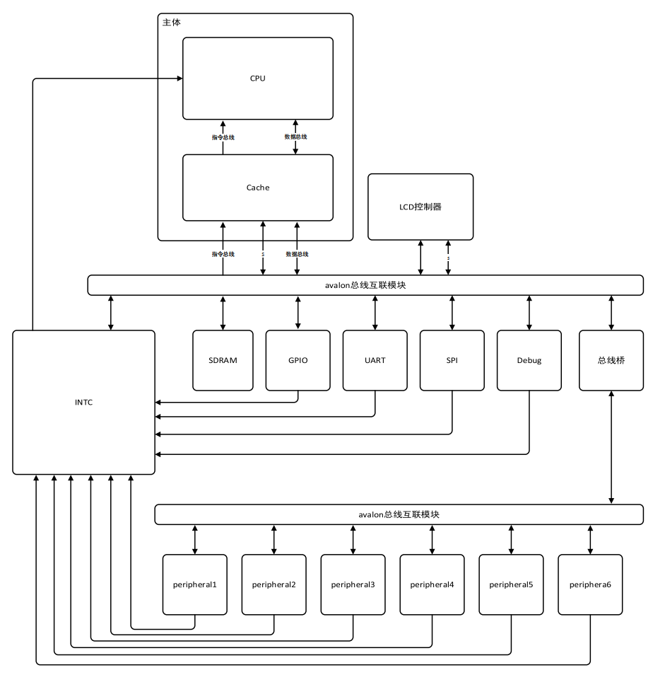

# RISCV_CPU

我的毕业设计

这个项目会持续更新到2020年6月份。

* 2020年02月14日：项目蓝图如上，现在正在弄cache。
* 2020年03月14日：cache测试完成了，但是还有一些非重点功能没做，比如冲刷cache，关闭cahce等。现在先开始弄CPU核，毕业要紧。
* 2020年03月24日：取指完成了，开始译码。
* 2020年04月06日：大致框架写得差不多了，不过估计还一堆bug，难度好像超过了预期，先跑通基础算术指令和对齐的访存指令吧，加油！
* 2020年04月12日：跑通斐波那契数列的C语言程序，总算有点大的进展。

我的QQ:1939261764，有兴趣可以一起讨论想法呀。
